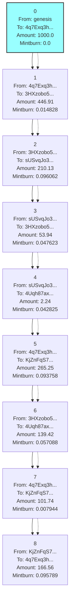

```mermaid
graph TD
    0[0<br/>From: genesis<br/>To: 4q7Exq3h...<br/>Amount: 1000.0<br/>Mintburn: 0.0]
    1[1<br/>From: 4q7Exq3h...<br/>To: 3HXzobo5...<br/>Amount: 446.91<br/>Mintburn: 0.014828]
    2[2<br/>From: 3HXzobo5...<br/>To: sUSvqJo3...<br/>Amount: 210.13<br/>Mintburn: 0.096062]
    3[3<br/>From: sUSvqJo3...<br/>To: 3HXzobo5...<br/>Amount: 53.94<br/>Mintburn: 0.047623]
    4[4<br/>From: sUSvqJo3...<br/>To: 4Uqh87ax...<br/>Amount: 2.24<br/>Mintburn: 0.042825]
    5[5<br/>From: 4q7Exq3h...<br/>To: KjZnFqS7...<br/>Amount: 265.25<br/>Mintburn: 0.093758]
    6[6<br/>From: 3HXzobo5...<br/>To: 4Uqh87ax...<br/>Amount: 139.42<br/>Mintburn: 0.057088]
    7[7<br/>From: 4q7Exq3h...<br/>To: KjZnFqS7...<br/>Amount: 101.74<br/>Mintburn: 0.007944]
    8[8<br/>From: KjZnFqS7...<br/>To: 4q7Exq3h...<br/>Amount: 166.56<br/>Mintburn: 0.095789]
    0 --> 1
    0 -.-> 1
    1 --> 2
    1 -.-> 2
    2 --> 3
    2 -.-> 3
    3 --> 4
    3 -.-> 4
    4 --> 5
    4 -.-> 5
    5 --> 6
    5 -.-> 6
    6 --> 7
    6 -.-> 7
    7 --> 8
    7 -.-> 8

    %% Styling
    classDef block fill:#f9f,stroke:#333,stroke-width:2px
    classDef genesis fill:#9ff,stroke:#333,stroke-width:2px
    class 0 genesis
```