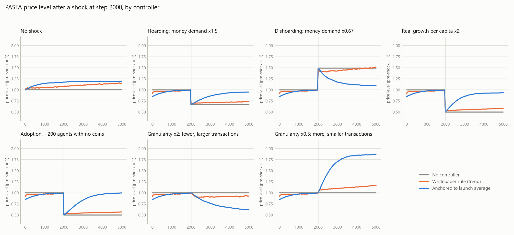
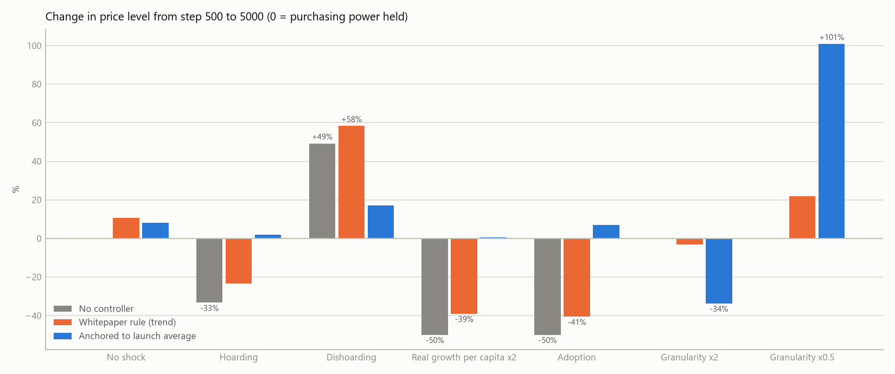
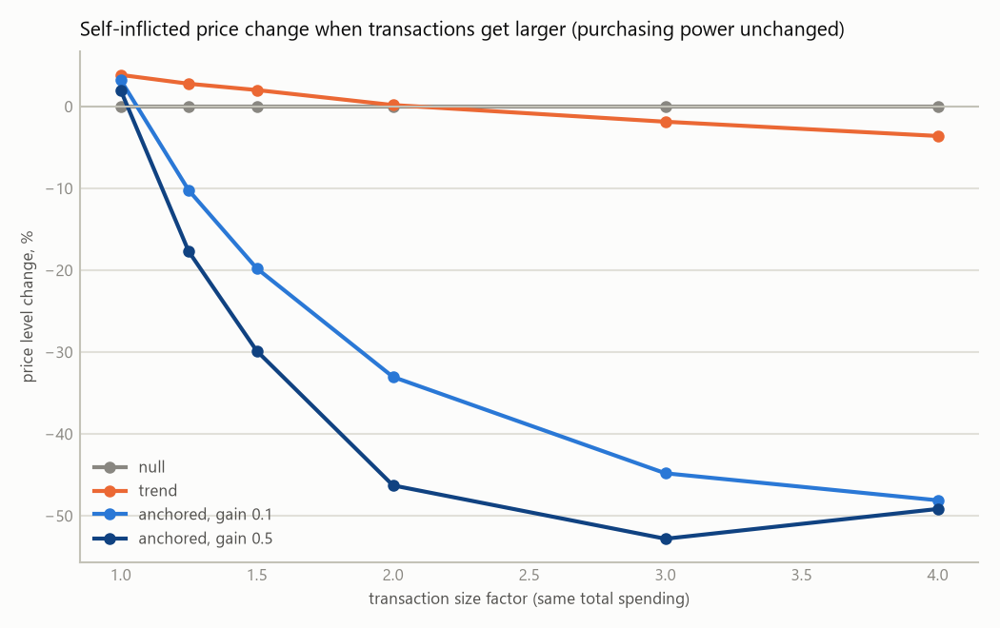
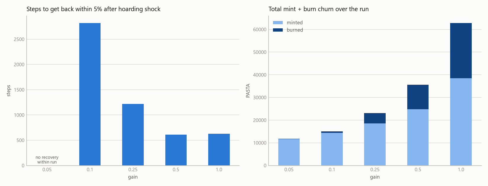
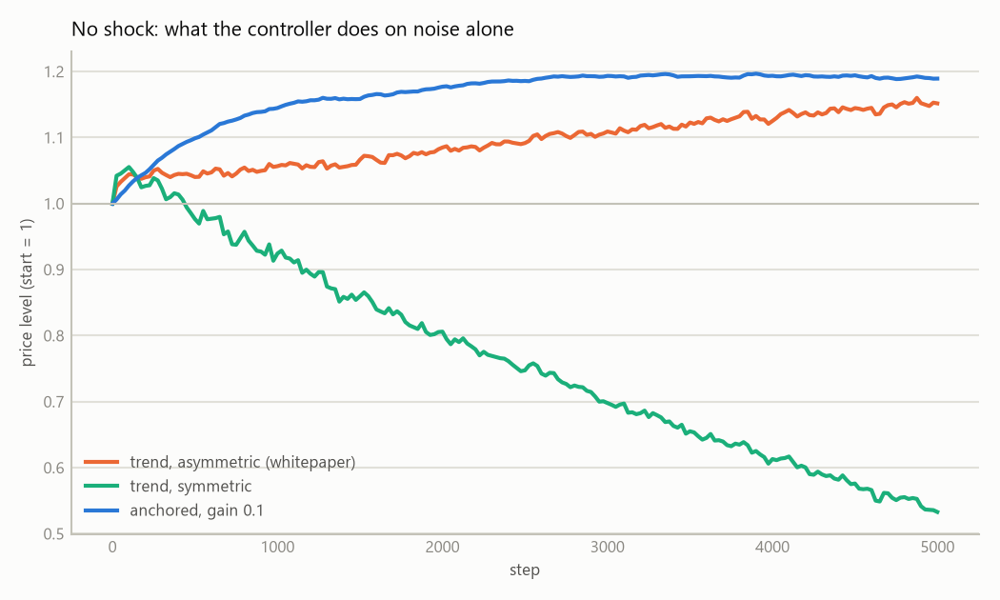

# PastaTester results memo (living document)

Findings from `python -m pasta.sim` about the whitepaper's stability mechanism. Each entry
records the exact command so it can be re-run. Numbers are for the default economy
(200 agents, 5000 steps, seed 1, money demand k = 20, purchase probability 0.10, mean real
price 1.0, lognormal sigma 0.6) unless stated. "Drift" is the change in the PASTA price
level `p` (PASTA per unit of real goods) from step 500 to the end; a flat `p` means constant
purchasing power. Model definition: docstring of `pasta/sim/economy.py`. Controllers:
docstring of `pasta/stability/controller.py`.

## Figures and the public page

`python -m pasta.sim.report --figures docs/figures --js <site>/results/data.js` regenerates
everything below from `pasta/sim/experiments.py`. The interactive version is published at
https://pastacoin.org/results/ (source: `results/` in the `pastacoin.github.io` repo).

| Figure | Shows |
|---|---|
| `docs/figures/shocks-small-multiples.png` | Price level over time under each shock, three policies |
| `docs/figures/drift-by-shock.png` | Final price change per shock and policy |
| `docs/figures/granularity-sweep.png` | Self-inflicted price change vs transaction size factor (k = 100) |
| `docs/figures/gain-tradeoff.png` | Recovery steps and mint/burn churn vs gain (hoarding shock) |
| `docs/figures/bias-no-shock.png` | What each controller does with no shock at all |
| `docs/figures/round2-shocks-attacks.png` | Round two: four policies under seven shocks and two attacks |
| `docs/figures/round2-cap-tradeoff.png` | Recovery time vs damage-when-fooled across supply caps |
| `docs/figures/round2-growth-allowance.png` | Flow-rule growth allowance vs true steady growth |

## 2026-09-28 — round two: a robust signal, supply-sized adjustments, a rate cap, and attackers

Closes #27, #28 and the stability side of #13. Code: `pasta/stability/controller.py`
(`AnchoredSizeController`, `FlowPerUserController`), attackers and holders in
`pasta/sim/economy.py`, matrix in `pasta/sim/experiments.py` (`shocks_v2`, `attacks`,
`variants`, `cap_sweep`, `growth_allowance_sweep`). Round two runs with money demand 100 so
agents hold about ten payments and affordability skips no longer distort the statistics.

### What changed in the controllers

- **Per period, not per transaction.** Each period the controller computes one supply change
  from its signal, `ΔM = -gain × signal × M`, bounded by `cap_rate × M`, and dispenses it across
  the next period's transactions **in proportion to their amounts**. Sizing is a fraction of
  supply, not of the carrier transaction, which removes the round-one bias (#28).
- **Dust floor.** Amounts below 5 % of the running median are ignored when computing the
  signal. Without it, sybil dust drags the median to zero and the controller mints at the cap
  forever.
- **Two signals.** `size`: the period **median** transaction size against a launch anchor.
  `flow`: nominal flow per **holder** (addresses holding at least half a typical payment)
  against a launch anchor with an optional growth allowance. Counting *active addresses*
  instead of holders makes the flow rule as frequency-sensitive as the size rule.
- **Attackers.** Wash pairs bounce a typical payment ten times a step; sybils are 200 dust
  addresses making two dust payments each per step. Both buy their stake from honest agents,
  so the money supply is unchanged; `attacker_gain` is the mint they harvest.

### Results (drift from step 500 to 5000; shock or attack at step 2000)

| case | no controller | round one anchored | median size | flow per holder |
|---|---|---|---|---|
| none | 0.0 % | +3.3 % | -1.3 % | +3.0 % |
| hoarding x1.5 | -33.3 % | -12.8 % | **-2.1 %** (recovers in 1040) | **-0.4 %** (1230) |
| dishoarding x0.67 | +49.3 % | +14.2 % | **+1.0 %** | +8.3 % |
| real growth per capita x2 | -50.0 % | -14.2 % | **-1.6 %** | **-50.5 %** (blind) |
| adoption +200 users | -50.0 % | -15.1 % | **-0.5 %** | **+3.7 %** |
| granularity x2 | 0.0 % | -33.0 % | **-50.2 %** (self-inflicted) | **+12.2 %** |
| granularity x0.5 | 0.0 % | +71.6 % | **+96.9 %** (self-inflicted) | **-1.0 %** |
| wash trading | 0.0 % | +17.7 %, attackers gain 10x their stake | -2.8 %, attackers lose 80 % | +1.5 %, attackers lose 99 % |
| sybil dust | 0.0 % | **+364 %** | -1.3 %, no gain | +2.7 %, no gain |

Design-choice table (which knob fixes what): with the dust floor off, the median-size rule
inflates 376 % under sybil and the attackers harvest 14k PASTA; counting active addresses
instead of holders, the flow rule inflates 545 % and hands over 20k; dispensing evenly per
transaction instead of proportionally changes little once the dust floor is on, but was what
let sybils harvest 95 % of the mint before it.

Cap sweep (median-size rule at gain 0.01, so the cap binds): with no cap, a fooled signal
inflates 8,063 % and hoarding recovers in 199 steps; at 0.02 % of supply per period the
same misread is limited to +85 % and hoarding recovers in 1,644 steps; 0.05 % gives +375 %
and 659 steps; 0.1 % gives +2,194 % and 334 steps. The cap is the insurance and its price is
recovery speed.

Growth allowance (steady real growth of 0.02 % per period, x2.7 over the run): the flow rule
with no allowance deflates 60 %, the same as no controller; with the allowance equal to the
true rate it drifts -11 %; but that same allowance with no growth inflates 129 %. The
median-size rule holds growth to -4.6 % with no allowance at all, because the median falls
with the price level.

### What this says

1. **Both round-two rules fix what round one broke.** Supply-sized adjustments remove the
   steady-state bias; the dust floor and holder counting make sybil spam harmless; proportional
   dispensing plus burns make wash trading a losing trade. The round-one rule, by contrast, is
   destroyed by sybil dust (+364 %) and pays wash traders ten times their stake.
2. **Neither signal is complete, and their blind spots are mirror images.** The median-size
   rule handles hoarding, growth and adoption within 2 % and fails granularity by 50 to 97 %.
   The flow-per-holder rule handles hoarding, adoption and granularity within 12 % and misses
   per-capita real growth entirely. This is the identification problem stated in yesterday's
   discussion, now measured: on chain, "the economy grew and prices fell" and "people started
   paying in smaller pieces" look the same. Size treats both as deflation; flow treats both as
   nothing.
3. **A growth allowance is a bet, not a fix.** It works only if it matches the true rate, and
   it costs 129 % inflation over the run when growth fails to show up. The size rule does not
   need it.
4. **The cap is worth its price.** It turns an unbounded failure into a bounded one. Set it
   from the horizon: 0.02 % per period was enough here, and a real deployment should express
   it as a few percent per year.
5. **Which to ship.** The chain data (`CHAINS-COMPARISON.md`) says granularity shifts on
   payment-style chains were small over 13 years while the median tracked purchasing power,
   which favours the median-size rule with a dust floor and a cap as the primary signal. The
   flow-per-holder signal is the right *veto*: a step change in the median with no change in
   flow per holder is a structural shift, not inflation, and should re-anchor rather than
   trigger. That hybrid is the next experiment (issue to follow).

## 2026-09-27 — first pass: does the average-transaction-size rule hold purchasing power?

### Setup

Three policies compared under one shock at step 2000:

- `null`: no mint or burn (baseline).
- `trend`: the whitepaper rule read literally. Signal = fast EMA of tx size vs slow EMA.
  Mint only into above-average transactions when the average is falling; burn only from
  below-average transactions when it is rising. Gain 0.5, cap 10 % of the transaction.
- `fixed`: same asymmetric rule, but the signal is the EMA of tx size vs a fixed target
  equal to the launch-time average (50 PASTA here). Gain 0.1 unless stated.

Command shape: `python -m pasta.sim --controller <c> [--param target=50 --param gain=0.1] --shock 2000:<kind>:<factor>`

### Results (price-level drift, step 500 to 5000)

| Shock at step 2000 | What happens to purchasing power | null | trend (whitepaper literal) | fixed anchor at launch avg, gain 0.1 |
|---|---|---|---|---|
| none | nothing | 0.0 % | **+10.7 %** | -0.3 % |
| money demand x1.5 (hoarding) | falls 33 % | -33.3 % | -23.2 % | **+2.0 %** (recovers to within 5 % after ~2800 steps; gain 0.5 recovers in ~600 steps at the cost of 15x more burn churn) |
| money demand x0.67 (dishoarding) | rises 49 % | +49.3 % | +58.3 % | +17.2 % |
| per-capita real growth x2 | rises 100 % | -50.0 % | -39.1 % | **+0.4 %** (M grew +101 %) |
| adoption: +200 agents with no coins | rises 100 % | -50.0 % | -40.6 % | **+7.1 %** (M grew +114 %) |
| granularity x2: same real spending, half as many transactions each twice as large | **unchanged** | 0.0 % | -3.0 % | **-33.7 %** (self-inflicted) |
| granularity x0.5 | **unchanged** | 0.0 % | (not run) | **+100.8 %** (self-inflicted) |

Seeds 1 to 5 give the same picture (trend under hoarding: -23.2 % to -24.4 %).

### What this says

1. **A trend-only rule cannot restore purchasing power; it can only slow a change.** After a
   shock the slow average converges to the new level and the controller stops. It cut the
   hoarding shock from -33 % to -23 % and no more. The whitepaper's phrase "keep transaction
   sizes consistent over time" needs an anchor: a target average fixed at launch (or an
   extremely slow reference). With that anchor the rule does what the whitepaper claims for
   monetary shocks: hoarding, dishoarding, real growth and adoption were all brought back to
   within a few percent, and the money supply grew with the economy (+101 % for a 2x real
   economy, +114 % for 2x agents).

2. **The literal asymmetry rule is biased, and so is the anchored rule at low gain.** With no
   shock at all the asymmetric trend controller inflated the price level by 10.7 %, a
   symmetric variant deflated it by 45 %, and the anchored rule at gain 0.1 climbed 19 % from
   launch (8 % after warm-up) before flattening. Two causes. First, mint and burn are sized
   as a fraction of the transaction they ride on. Second, the controller only sees executed
   transactions: large purchases skipped as unaffordable pull the observed average below the
   anchor, so it mints until the observed average matches. The second effect is partly a
   model artefact (see limitations) and partly real, since any live network also only
   observes transactions that clear.
   Mints attach to above-average (large) transactions and burns to below-average (small)
   ones, so mints outweigh burns for the same signal; the symmetric version has the
   opposite bias because burns happen when prices are high (amounts large). Any final rule
   must size adjustments independently of the carrier transaction, or normalise them, before
   the asymmetry can be trusted as an anti-manipulation device. Follow-up issue filed.

3. **Granularity is the real threat, and the anchored rule makes it worse, not better.** If
   people move the same real spending into half as many transactions, purchasing power is
   unchanged but the average transaction size doubles. The anchored controller reads that as
   inflation and burns a third of the money supply (gain 0.1) — more with higher gain. The
   whitepaper argues such shifts are unlikely to be economy-wide; that may be true, but the
   controller has no way to tell a granularity shift from inflation because both raise the
   average. The trend controller is nearly immune only because it gives up after any level
   change, which is also why it is useless against real inflation. A signal that separates
   "prices rose" from "people batch purchases" is the central open design problem. Candidates
   to test next: nominal spending per active address per period (immune to granularity, but
   blind to per-capita real growth), transaction-count-weighted measures, and combinations.

4. **Gain trades recovery speed for churn.** Under hoarding with the anchored rule, gain 0.05
   never gets back within 5 % in 3000 steps, gain 0.1 takes ~2800 steps with almost no burn,
   gain 0.5 takes ~600 steps but burns 10.8k PASTA against 24.8k minted. Final drift is
   within 5 % for all of them. Low gain with long horizons looks preferable; the "small,
   continuous adjustments" language in the whitepaper points the same way.

5. **Deflationary side is weaker.** Dishoarding (k x0.67) ended +17 % with the anchored rule
   versus +2 % for the mirror-image hoarding case. The asymmetric rule only burns from
   below-average transactions and the burn cannot exceed the transaction, so the burn side
   has less capacity than the mint side.

### Model limitations to keep in mind

- With k = 20 and purchase probability 0.10 each agent holds about two purchases worth of
  money, so roughly 45 % of attempted purchases are skipped as unaffordable. This biases
  observed averages (larger purchases are skipped more) and damps nominal volume. Raising k
  reduces skips; the qualitative results above did not depend on it, but the numbers do.
- Sellers receive mint/burn; buyers always pay the face amount. The whitepaper describes the
  same direction (payer loses less than recipient gets) but the split is a free design choice.
- Price level is a closed-form quantity-theory expression, not an emergent market price.
  There are no expectations, no interest, no external exchange rate.
- No adversarial agents yet (self-dealing, wash trading); see issue #13.

### Granularity sweep (k = 100 so agents can afford the larger purchases)

Final price change when the same real spending is done in transactions `f` times larger:

| f | null | trend | anchored, gain 0.1 | anchored, gain 0.5 |
|---|---|---|---|---|
| 1.0 | 0.0 % | +3.9 % | +3.3 % | +2.0 % |
| 1.25 | 0.0 % | +2.8 % | -10.2 % | -17.7 % |
| 1.5 | 0.0 % | +2.0 % | -19.8 % | -29.9 % |
| 2.0 | 0.0 % | +0.2 % | -33.0 % | -46.3 % |
| 3.0 | 0.0 % | -1.9 % | -44.8 % | -52.8 % |
| 4.0 | 0.0 % | -3.6 % | -48.1 % | -49.2 % |

The damage saturates around -50 % because burns are capped at a fraction of each
transaction and only apply to below-average ones.

### Next experiments

- Signal alternatives robust to granularity (per-address nominal spending, hybrid).
- Adjustment sizing independent of carrier transaction (fixed-size or supply-fraction).
- Attack models: an agent pair wash-trading to move the average; cost to attacker vs damage.
- Longer horizons and repeated shocks; k sweep to check sensitivity to the skip rate.
